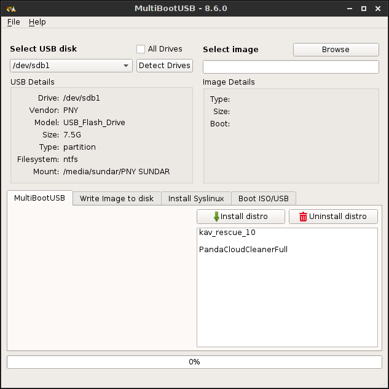
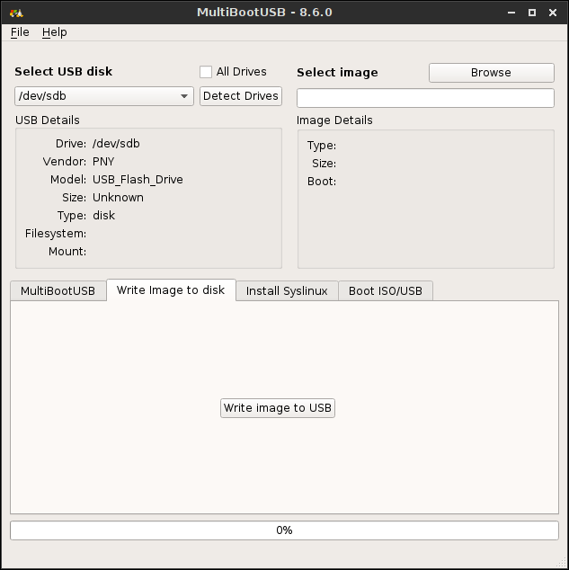
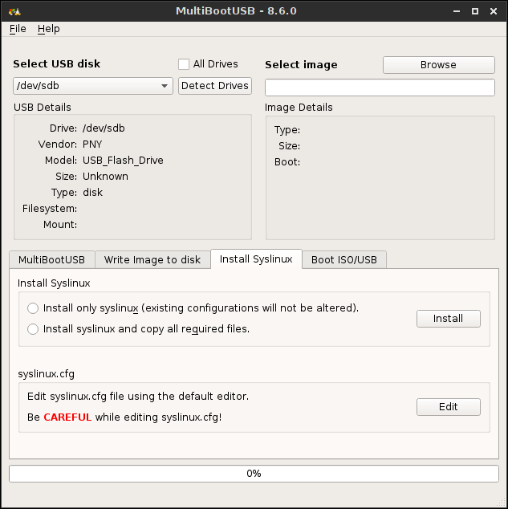
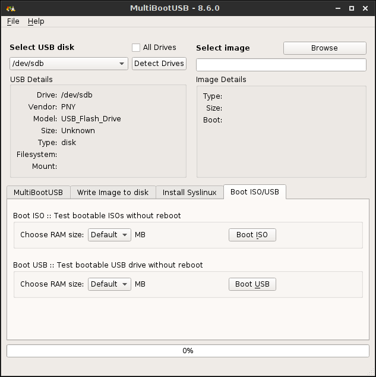

There has been lot of work since last release. The major one is the initial support for UEFI/EFI boot. It took lot of time
to make it automate auto generation of GRUB2 supported loopback.cfg file from syslinux supported config files, so the delay.
Mean while, **"Alin Trăistaru (alindt)"** came from no where and chaged the look and user experience of the software. I thank him 
for his valuable contribution and all credits goes to him for redesigning of GUI and code cleanups. Some of the major changes since last release are:-

* Fresh and friendly user interface (GUI)
* Initial support for UEFI/EFI boot
* Added GRUB2 boot loader
* Auto creation of loopback.cfg file for GRUB2 support
* Direct ISO write to USB now uses '"oflag=sync"' flag
* Use system pyudev library by default
* Fixed syslinux install failure in distro dir on ext2/3/4
* Fixed crash when writing ISO to USB on Windows
* Detection of isolinux version 2 shipped by disto and install version 3 instead on usb
* Improvements to persistence logic
* Simplified USB disk detection
* Improved CentOS detection
* Improved user experience through rewording display messages
* Fix for creating persistence on mount points containing spaces
* Fixed kaspersky install issue
* Improved fedora detection script
* Added support for Virtualized USB. https://github.com/mbusb/multibootusb/issues/110
* Added PLOP boot manager
* Added Dam Small Linux
* Added netboot.iso
* Added latest memtest
* Added slack mini boot
* Added Fat Dog
* Added Finnix
* And few other minor improvemnts 

__Some screenshots of new GUI:-__

* Main Screen

 

* Imager tab renamed to  **Write Image to Disk**

 

* Syslinux Tab

 

* QEMU tab renamed to  **Boot ISO/USB**

 

 
Go to [Download](http://multibootusb.org/page_download) page for download option...

